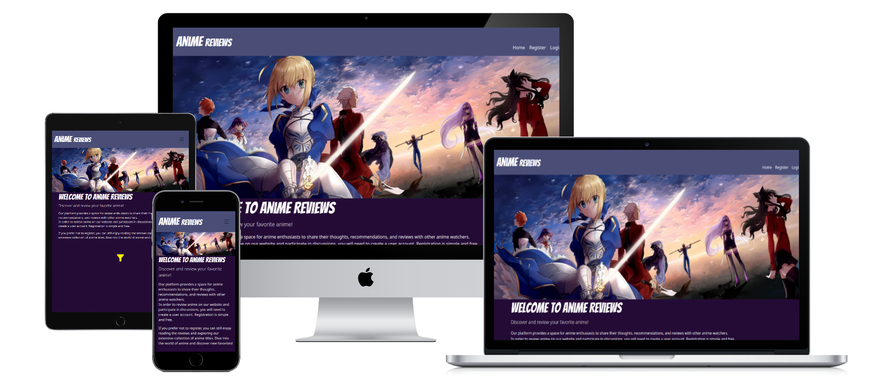

# Anime Reviews

[Anime Reviews](https://anime-reviews-07dfc677e4f4.herokuapp.com/) is a dedicated platform for anime enthusiasts to explore, review, and discuss anime titles. Users can create and submit their own anime reviews, including ratings, review, and detailed opinions. Each review is open to comments, likes, and dislikes from other users, allowing community interaction and diverse viewpoints. The site offers filtering options for easy navigation. Moderation ensures a respectful environment.

## Purpose
This project aims to create a platform for anime enthusiasts, allowing exploration, discussion, and review of their favorite anime series. By implmeneting Django's robust framework and integrating a powerful database backend, the objective is to provide users with a seamless and efficient experience navigating through an extensive collection of anime titles. 
By utilizing Django, the creation of the website becomes rather efficient while ensuring scalability, maintainability, and security.
A crucial aspect of this project is the integration of a database to store and manage anime-related data efficiently. By implementing a database schema tailored to the requirements of the platform, we can store information about anime titles, user reviews, ratings, comments etc. 
The website will provide users with various interactive features, including the ability to browse, filter anime titles based on release dates, and alphabetical. Additionally, users can contribute their reviews through the process.  

Here is the live version of the website [click here](https://anime-reviews-07dfc677e4f4.herokuapp.com/)
___
## UI/UX
The design of the website draws inspiration from the vibrant and youthful characteristics of the diverse world of Anime.
Each element on the site is permeated with bold, popping colors, adding a visual flair that enhances engagement and captivates visitors. The overall design is simple and very straightforward in terms of usability, while the features are tailored to meet the requiremtns of a review based platoform.

### Agile 
At the beginning of the development stage, Agile approach was initiated for project management. This allowed flexibility with implementing features and keeping track of tasks on hand in relation to the project. It was made possbil by creating user stories of each sgement of the features and adding them to the canban board. Here is my [Github Project](https://github.com/users/sakixchy/projects/7) where i have kept track of my progress during the development.

### Wireframes
[Balsamiq](https://balsamiq.com/) was utilized to create a visual representation of a concept of the website prior to start developing it. Below are all wireframes for this project:  

    

        Desktop Wireframes
    

    

    

        Mobile Wireframes
    

    

