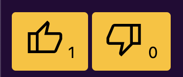
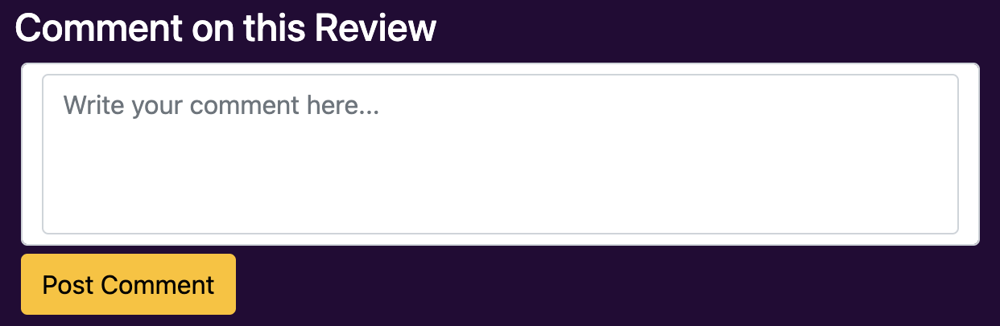

# Anime Reviews

[Anime Reviews](https://anime-reviews-07dfc677e4f4.herokuapp.com/) is a dedicated platform for anime enthusiasts to explore, review, and discuss anime titles. Users can create and submit their own anime reviews, including ratings, review, and detailed opinions. Each review is open to comments, likes, and dislikes from other users, allowing community interaction and diverse viewpoints. The site offers filtering options for easy navigation. Moderation ensures a respectful environment.

## Purpose
This project aims to create a platform for anime enthusiasts, allowing exploration, discussion, and review of their favorite anime series. By implmeneting Django's robust framework and integrating a powerful database backend, the objective is to provide users with a seamless and efficient experience navigating through an extensive collection of anime titles. 
By utilizing Django, the creation of the website becomes rather efficient while ensuring scalability, maintainability, and security.
A crucial aspect of this project is the integration of a database to store and manage anime-related data efficiently. By implementing a database schema tailored to the requirements of the platform, we can store information about anime titles, user reviews, ratings, comments etc. 
The website will provide users with various interactive features, including the ability to browse, filter anime titles based on release dates, and alphabetical. Additionally, users can contribute their reviews through the process.  

Here is the live version of the website [click here](https://anime-reviews-07dfc677e4f4.herokuapp.com/)
___
## UI/UX
The design of the website draws inspiration from the vibrant and youthful characteristics of the diverse world of Anime.
Each element on the site is permeated with bold, popping colors, adding a visual flair that enhances engagement and captivates visitors. The overall design is simple and very straightforward in terms of usability, while the features are tailored to meet the requiremtns of a review based platoform.

### Agile 
At the beginning of the development stage, Agile approach was initiated for project management. This allowed flexibility with implementing features and keeping track of tasks on hand in relation to the project. It was made possbil by creating user stories of each sgement of the features and adding them to the canban board. Here is my [Github Project](https://github.com/users/sakixchy/projects/7) where i have kept track of my progress during the development.

### Wireframes
[Balsamiq](https://balsamiq.com/) was utilized to create a visual representation of a concept of the website prior to start developing it. These Mockup are not actual represntation of the final website but rather for planning purposes.  
Below are all wireframes for this project:  

    

        Desktop Wireframes
    

    
    
    
    
    
    

    

        Mobile Wireframes
    

    
    
    
    
    
    

### Site Goals
This site aims to provide a strong foundation for all anime fans around the world. It does so by allowing people to share their opinions on their Anime with other fellow anime wtachers. They have access to the basic charactersitics of an review site with features that empower an user to fully express their emotions through the site. The site also lets any visitor to have a fun time while reading and taking verdict from others on an Anime.

### Structure
#### Home Page
  
- Welcome Section: Greets site visitors and sets the tone for the browsing experience.
- Introductory Message: Offers a brief introduction to the website's purpose and features, helping users understand what the site offers.
- Anime Title Library: Provides a comprehensive library of anime titles for browsing, allowing users to explore and discover new content easily.

#### User Goal:
>   - Feel welcomed by the site.
>   - Understand the purpose and features of the site.
>   - Browse through the extensive anime titles.
#### Website Goal:
>   - Make the site visitor feel weclomed.
>   - Inform the visitor about necessary information.
>   - Let the users able sort anime titles by filtering method.
>   - Showcase all titles in one place for browsing 

### Sign Up Page
  
- Intuitive Signup Method: Offers a user-friendly and straightforward signup process.
- Detailed Help Text: Provides comprehensive help text to assist users in completing the signup process successfully. 

#### User Goal:
>   - Create an account with ease and get access to restricted pages.
#### Website Goal:
>   - Allow users to create an account.

### Login Page
  
- Intuitive Login Method: Offers a user-friendly and straightforward login process.

#### User Goal:
>   - Login to the website with the provided cedentials.
#### Website Goal:
>   - Allow users to login with their account.

### Create Review Page
  
- Create Anime Reviews: Allows users to compose detailed reviews of anime titles they've watched, including text fields for title, review content, rating, and an image of an Anime.

#### User Goal:
>   - Create a review with provided details and submit it for view.
#### Website Goal:
>   - Provide users with input fields and allow submission of reviews.

### Edit Review Page
  
- Edit Anime Reviews: Owner of review titles can access to edit functionality to revise and update exisitng reviews.

#### User Goal:
>   - Users can edit their existing anime reviews to update information, improve clarity, or correct errors.
#### Website Goal:
>   - Allowing editing process by providing users with access to their previously submitted reviews, allowing them to make modifications as needed.

### My Reviews Page
  
- My Anime Reviews: Provides a personalized list of all anime reviews submitted by the logged-in user, allowing them to easily access and manage their contributions.

#### User Goal:
>   - Users can access a convenient compilation of all anime reviews they have submitted, enabling them to review their contributions and make any necessary updates or modifications.
#### Website Goal:
>   - Enhance user experience by offering a dedicated page where users can effeórtlessly access and manage their own reviews.

### Review Detail Page
  
- Review Detail: Displays detailed information about a specific anime review, including the title, content, rating, and comments made by the user. Additionally, edit and delete functionality.

#### User Goal:
>   - Users can access comprehensive information about a specific anime review, enabling them to read a review, ratings, and opinions to inform their viewing decisions or engage in discussions with other users.
#### Website Goal:
>   - Provide users with an immersive and informative experience by presenting detailed information about individual anime reviews, enhancing user engagement and allowing discussions within a review.
___
## Design
### Color Scheme
The specific color scheme chosen was intended to make the foreground elements of the site pop, creating a striking contrast with other elements and enhancing the overall visual experience. By utilizing dark and contrasting colors, the scheme ensures that key components stand out effectively. 
 

### Typography 
The font style were selected to serve their respective purposes. The large heading conveys a comic and bold font whilst general writing of reviews remains true to blog style. The buttons have a standard font style found across blog sites. 
[Banger for Heading](https://fonts.google.com/specimen/Bangers?selection.family=Lato:wght@100)
[Lato for Blog](https://fonts.google.com/specimen/Lato?selection.family=Lato:wght@100)
[Roboto for Buttons](https://fonts.google.com/specimen/Roboto?selection.family=Lato:wght@100)

### Images
The hero image was selected from [here](https://ru.pinterest.com/pin/334321972329328873/) to capture the essence of anime, therefore making a fimiliar and inviting setting for the visitors.
The anime title images available for attachment to reviews are personal images chosen by users themselves. These images are not owned by the site but are instead provided by users to personalize their reviews and add visual context to their opinions.
___
## Features
### Existing Features
#### Navbar
The navbar consists of a logo which redirects to the 'home', nav links to other pages that are dynamically adjusted based on user authentication status, with certain links appearing or disppearing. The navbar is also adjusted for smaller screen sizes and has a different layout.  

    

        Desktop Navbar
    

    
    

    

        Mobile Navbar
    

    
    

#### Introduction Text
Provides users with useful information regarding the site, thereby familiarizing them with the platform.
  

#### Filter Button
The filter button enables users to arrange anime titles according to specific criteria or preferences.  
  

#### Anime Review list
The anime review list consists of cards serving as gateways to detailed reviews for each anime. With pagination, users can navigate through multiple pages of reviews straight from the home page.
  

#### My Reviews
The page only shows anime reviews submitted by an authenticated user otherwise a message informing users of no review being submitted by them.
  

#### Review Detail
The review detail page provides users with the ability to read reviews and interact with other elements of the site. Edit and Delete buttons dynamically adjust based on user authentication, appearing only for the user who submitted the review and disappearing for others. 
  

#### Impressions
Authenticated users can express their opinion on reviews by liking or disliking a review. They are displayed in various places of the site to provide community's sentiment towards a particular rev56iew.5
  

#### Comments
Authenticated users have the ability to post comments on reviews, initiating engagement and discussion within the community. They can read comments of others as well.  
  
- An example of posted comment:  
  

#### Edit Review
Authenticated users who have submitted reviews have the ability to edit or modify them. While users cannot change the associated image, as it is fixed for moderation purposes, all other fields are open for amendment.  
  

#### Delete Review
Authenticated users who have submitted reviews have the ability to delete them. Users will receive a prompt before deleting the review permanently.  
  

#### Create Review
Authenticated users can submit a review for an anime title. This feature enables users to share their opinions, insights, and recommendations with the community, contributing to a rich and diverse collection of reviews on the platform. All fields must be filled to submit a review or else the form won't be submitted.  
  

#### Signup 
Allows users to create an account with the site using username, password and password confirmation.  
  

#### Login
Allows users to login to the site with user credentials, which are username and password. An option to remmeber login details.A forgot password link to reset password.  
  

#### Logout 
Upon selecting logout, users are directed to a dedicated logout page. Upon confirmation, users are redirected back to the home page  
  

#### Footer
The footer displays copyright information to uphold rights to site material and protect against infringement.  
  

### Future Features
### Anime Model
An anime model to compliment the exiting models for this project that allows dropdown selection of anime titles on the review submission page. The anime model will include the title, image and release date. Access to this feature will be exclusevly available to the site admin.

### Genre
The genre tags will be integrated within the anim ereviews and users will have the ability to filter reviews based on their preferred genres.
___
## Database Design
### Database (ERD) Table
The table was created by a website called [Lucid Chart](https://www.lucidchart.com).  
  

### CRUD
The CRUD functionality serves as the backbone of the database relationship. Reviews utilize this functionality to Create, Read, Update, and Delete data, ensuring seamless management and manipulation of anime reviews. This allows users to interact with reviews effectively, from submitting new reviews to editing existing ones, and reading their own reviews to ultimately deleting them.
___
## Technologies Used
- [Balsamiq](https://balsamiq.com/)(Wireframes)
- [Lucidchart](https://lucidchart.com/)(ERD Database Table)
- [GitHub](https://github.com)(Version Control)
- [GitPod](https://gitpod.io)(IDE)
- [Heroku](https://heroku.com)(Site Hosting)
- [Cloudinary](https://cloudinary.com)(Serving Images)
- [Black](https://pypi.org/project/black/)(Code Formatter)
- [Whitenoise](https://whitenoise.readthedocs.io/en/stable/index.html)(Static files serving for Django)
- [Gunicorn](https://gunicorn.org/)(WSGI HTTPS Request)
- [pyscopg2](https://pypi.org/project/psycopg2/)(PostgreSQL Database adapter)
- [django-allauth](https://docs.allauth.org/en/latest/installation/quickstart.html)(User Authentication)
- [dj3-cloudinary-storage](https://pypi.org/project/django-cloudinary-storage/)(Django storage for Cloudinary)
- [ElephantSQL](https://www.elephantsql.com/)(PostgreSQL database hosting)
- [Summernote](https://summernote.org/getting-started/#integration)(WYSIWYG Editor)(Not fully implemented)
___
## Testing
### Manual Testing
The full manual testing is being done in a separate file, to view it click [here](TESTING.md).

### Validator Testing
HTML [W3C Validator](https://validator.w3.org/) was used to check for any errors or bad practices.  
- Home 
  
- Register
  
- Login
  
- Logout

- Create Review
  
- My Reviews
  
- Review Detail
  
- Edit Review
  
- Logout
[logout html validation](readme/assets/code-validations/logout-html-validator.png)  

CSS [Jigsaw](https://jigsaw.w3.org/css-validator/)  

